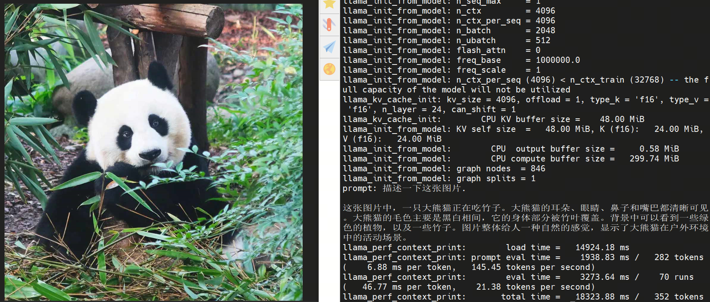

English| [简体中文](./README_cn.md)

Getting Started with Hobot Llamacpp Project
=======

# Feature Introduction

The hobot llamacpp package is an example project that integrates large language models (LLMs) and vision-language models (VLMs) based on [llama.cpp](https://github.com/ggml-org/llama.cpp). It provides two main functionalities:

- Pure Language Model (LLM): Supports setting system prompts, accepting prompt text input, and generating text-based dialogue output. The text input can be configured via parameters or dynamically controlled at runtime through string msg topic messages. The generated text output is published via string msg topic messages.

- Vision-Language Model (VLM): Supports setting system prompts, accepting both prompt text and image inputs, and generating text-based dialogue output. The text input can be configured via parameters or dynamically controlled at runtime through string msg topic messages. Image data can come from local image playback or subscribed image msg topics. The generated text output is published via string msg topic messages.

# Development Environment

- Programming Language: C/C++
- Development Platform: X5
- System Version: Ubuntu 22.04
- Compilation Toolchain: Linaro GCC 11.4.0

# Compilation

- X5 Version: Supports compilation on the X5 Ubuntu system and cross-compilation using Docker on a PC.

It also supports controlling the dependencies and functionality of the compiled pkg through compilation options.

## Dependency Libraries

- OpenCV: 3.4.5

ROS Packages:

- dnn_node
- cv_bridge
- sensor_msgs
- hbm_img_msgs
- ai_msgs

hbm_img_msgs is a custom image message format used for image transmission in shared memory scenarios. The hbm_img_msgs pkg is defined in hobot_msgs; therefore, if shared memory is used for image transmission, this pkg is required.

## Docker Cross-Compilation for X5 Version

1. Compilation Environment Verification

- Compilation within docker, and TogetherROS has been installed in the docker environment. For instructions on docker installation, cross-compilation, TogetherROS compilation, and deployment, please refer to the README.md in the robot development platform's robot_dev_config repo.
- The dnn node package has been compiled.
- The hbm_img_msgs package has been compiled (see Dependency section for compilation methods).

2. Compilation

- Link third Party [llama.cpp](https://github.com/ggml-org/llama.cpp):
 
  ```shell
  cmake -B build
  cmake --build build --config Release
  cd hobot_llamacpp && ln -s thirdparty/llama.cpp llama.cpp
  ```

- Compilation command:

  ```shell
  # RDK X5
  colcon build --merge-install --cmake-args -DPLATFORM_X5=ON --packages-select hobot_llamacpp
  ```

- Shared memory communication method is enabled by default in the compilation options.

# Notes

## Dependencies

- mipi_cam package: Publishes image messages
- usb_cam package: Publishes image messages
- websocket package: Display image messages

## Parameters

| Parameter Name      | Explanation                            | Mandatory            | Default Value       | Remarks                                                                 |
| ------------------- | -------------------------------------- | -------------------- | ------------------- | ----------------------------------------------------------------------- |
| feed_type           | Data source, 0: vlm local; 1: vlm subscribe; 2: llm subscribe  | No                   | 0                   |                                                                         |
| image               | Local image path                       | No                   | config/image2.jpg     |                                                                         |
| is_shared_mem_sub   | Subscribe to images using shared memory communication method | No  | 0                   |                                                                         |                                                                   |
| llm_threads | LLM Run num of threads | No | 8 | |
| model_file_name | vision model file name | No | vit_model_int16_v2.bin | |
| llm_model_name | language model file name | No | Qwen2.5-0.5B-Instruct-Q4_0.gguf | |
| user_prompt | language model user prompt | No | "" |  |
| system_prompt | language model system prompt | No | "You are a helpful assistant." |  |
| pre_infer | pre infer button | No | 0 |  |
| ai_msg_pub_topic_name | Topic name for publishing intelligent results | No                   | /llama_cpp_node | |
| text_msg_pub_topic_name | Topic name for publishing intelligent results for tts | No                   | /tts_text | |
| ros_img_sub_topic_name | Topic name for subscribing image msg | No                   | /image | |
| ros_string_sub_topic_name | Topic name for subscribing string msg to set user prompt| No                   | /prompt_text | |

## Instructions

- Prompts Publishing: hobot_llamacpp relies on user prompt from ros2 string msg messages. There is an example of how to use the string msg topic, where /prompt_text is the topic name. The data field contains a string that sets the prompt for the language model.

```shell
ros2 topic pub /prompt_text std_msgs/msg/String "{data: '请描述这张图片'}"
```

# Running

- The models required for the project need to be downloaded from the following source.

  - [Image Encoder](https://huggingface.co/D-Robotics/InternVL2_5-1B-GGUF-BPU/blob/main/rdkx5/vit_model_int16_v2.bin)

  - [Language Encoder and Decoder](https://huggingface.co/D-Robotics/InternVL2_5-1B-GGUF-BPU/blob/main/Qwen2.5-0.5B-Instruct-Q4_0.gguf)

- compile the project。

## Running on X5 Ubuntu System

Running method 1, use the executable file to start:
```shell
source ./install/setup.bash
export COLCON_CURRENT_PREFIX=./install
cp -r install/lib/hobot_llamacpp/config/ .

# Run mode 1: Use local JPG format image, input user prompt.
ros2 run hobot_llamacpp hobot_llamacpp --ros-args -p feed_type:=0 -p image:=config/image2.jpg -p image_type:=0 -p user_prompt:="描述一下这张图片."

# Run mode 2: Use the subscribed image msg (topic name: /image) for prediction, set the log level to warn. At the same time, publish a string topic (with the topic name /prompt_text) in another window to update the user prompt.
ros2 run hobot_llamacpp hobot_llamacpp --ros-args -p feed_type:=1 --ros-args --log-level warn -p ros_string_sub_topic_name:="/prompt_text"

ros2 topic pub /prompt_text std_msgs/msg/String "{data: '描述一下这张图片.'}"

# Run mode 3: Use the language model to chat
ros2 run hobot_llamacpp hobot_llamacpp --ros-args -p feed_type:=2 -p system_prompt:="config/system_prompt.txt" --ros-args --log-level warn

ros2 topic pub /prompt_text std_msgs/msg/String "{data: '你好早上好.'}"
```


Running method 2 using a launch file:
```shell
export COLCON_CURRENT_PREFIX=./install
source ./install/setup.bash

# Configure MIPI camera
export CAM_TYPE=mipi

ros2 launch hobot_llamacpp llama_vlm.launch.py
```

## Run on X5 yocto system

```shell
export ROS_LOG_DIR=/userdata/
export LD_LIBRARY_PATH=${LD_LIBRARY_PATH}:./install/lib/
cp -r install/lib/hobot_llamacpp/config/ .

# Run mode 1: Use local JPG format image, intput user prompt.
./install/lib/hobot_llamacpp/hobot_llamacpp --ros-args -p feed_type:=0 -p image:=config/image2.jpg -p image_type:=0 -p user_prompt:="描述一下这张图片."

# Run mode 2: Use the subscribed image msg (topic name: /image) for prediction, set the log level to warn. At the same time, publish a string topic (with the topic name /prompt_text) in another window to update the user prompt.
./install/lib/hobot_llamacpp/hobot_llamacpp --ros-args -p feed_type:=1 --ros-args --log-level warn -p ros_string_sub_topic_name:="/prompt_text"

ros2 topic pub /prompt_text std_msgs/msg/String "{data: '描述一下这张图片.'}"

# Run mode 3: Use the language model to chat
./install/lib/hobot_llamacpp/hobot_llamacpp --ros-args -p feed_type:=2 -p system_prompt:="config/system_prompt.txt" --ros-args --log-level warn

ros2 topic pub /prompt_text std_msgs/msg/String "{data: '周末应该怎么休息?'}"
```

# Results Analysis

## X5结果展示

Run：`ros2 run hobot_llamacpp hobot_llamacpp --ros-args -p feed_type:=0 -p image:=config/image2.jpg -p image_type:=0 -p user_prompt:="描述一下这张图片."`

```bash
[WARN] [1744635572.183177153] [llama_cpp_node]: Create ai msg publisher with topic_name: /llama_cpp_node
[INFO] [1744635572.214685272] [llama_cpp_node]: Dnn node feed with local image: image2.jpg
[INFO] [1744635574.739131628] [llama_cpp_node]: Output from frame_id: feedback, stamp: 0.0
llama_init_from_model: n_seq_max     = 1
llama_init_from_model: n_ctx         = 4096
llama_init_from_model: n_ctx_per_seq = 4096
llama_init_from_model: n_batch       = 2048
llama_init_from_model: n_ubatch      = 512
llama_init_from_model: flash_attn    = 0
llama_init_from_model: freq_base     = 1000000.0
llama_init_from_model: freq_scale    = 1
llama_init_from_model: n_ctx_per_seq (4096) < n_ctx_train (32768) -- the full capacity of the model will not be utilized
llama_kv_cache_init: kv_size = 4096, offload = 1, type_k = 'f16', type_v = 'f16', n_layer = 24, can_shift = 1
llama_kv_cache_init:        CPU KV buffer size =    48.00 MiB
llama_init_from_model: KV self size  =   48.00 MiB, K (f16):   24.00 MiB, V (f16):   24.00 MiB
llama_init_from_model:        CPU  output buffer size =     0.58 MiB
llama_init_from_model:        CPU compute buffer size =   299.74 MiB
llama_init_from_model: graph nodes  = 846
llama_init_from_model: graph splits = 1

这张图片展示了一只熊猫的场景。熊猫正趴在地上，周围有竹子。熊猫的耳朵竖起，眼睛睁大，看起来非常专注。背景中可以看到一些绿色的植物，可能是竹子。整个场景给人一种在自然环境中拍摄的感觉，可能是在动物园或野生动物保护区。熊猫的毛色是典型的黑白相间，非常可爱。
llama_perf_context_print:        load time =   11133.16 ms
llama_perf_context_print: prompt eval time =    2230.69 ms /   282 tokens (    7.91 ms per token,   126.42 tokens per second)
llama_perf_context_print:        eval time =    3745.39 ms /    74 runs   (   50.61 ms per token,    19.76 tokens per second)
llama_perf_context_print:       total time =   15033.11 ms /   356 tokens
```

Log result:



### 语言模型

Run：`ros2 run hobot_llamacpp hobot_llamacpp --ros-args -p feed_type:=2 -p system_prompt:="config/system_prompt.txt" -p user_prompt:="周末应该怎么休息?"`

```bash
system_info: n_threads = 8 (n_threads_batch = 8) / 8 | CPU : NEON = 1 | ARM_FMA = 1 | FP16_VA = 1 | DOTPROD = 1 | LLAMAFILE = 1 | OPENMP = 1 | AARCH64_REPACK = 1 |

prompt: "<|im_start|>system
你是一名人工智能助手。<|im_end|>
"
tokens: [ '<|im_start|>':151644, 'system':8948, '':198, '':56568, '':110124, '':104455, '':110498, '':1773, '<|im_end|>':151645, '':198 ]
Chat: interactive mode on.
sampler seed: 1302666639
sampler params:
        repeat_last_n = 64, repeat_penalty = 1.000, frequency_penalty = 0.000, presence_penalty = 0.000
        dry_multiplier = 0.000, dry_base = 1.750, dry_allowed_length = 2, dry_penalty_last_n = 4096
        top_k = 40, top_p = 0.950, min_p = 0.050, xtc_probability = 0.000, xtc_threshold = 0.100, typical_p = 1.000, top_n_sigma = -1.000, temp = 0.500
        mirostat = 0, mirostat_lr = 0.100, mirostat_ent = 5.000
sampler chain: logits -> logit-bias -> penalties -> dry -> top-k -> typical -> top-p -> min-p -> xtc -> temp-ext -> dist
generate: n_ctx = 4096, n_batch = 2048, n_predict = 128, n_keep = 0

> '周末应该怎么休息?'
 休息很重要，可以看看书、听音乐、画画、运动
```
